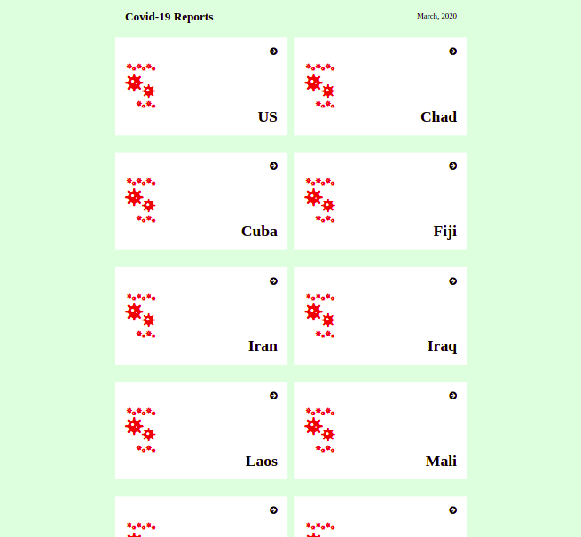
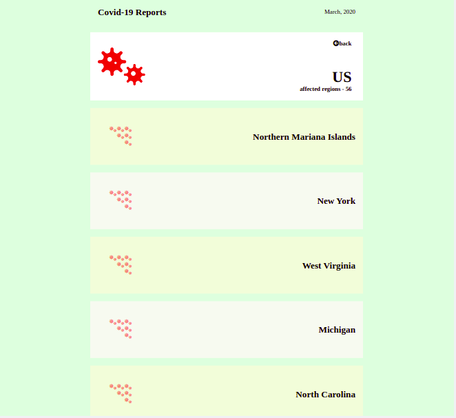

# Covid Reporter
This web application is built to display covid-19 data of countries affected by pandemic. The application allows users to view list of countries and regions/cities affected.

## Built With
- JavaScript/React
- Redux
- CSS

## Live Demo
- [View Video](https://www.loom.com/share/2f173a6ca1594c60a9e760d6d6ef74a3)
- [View Demo](https://duls-covid-reporter.herokuapp.com/)

## Setup
**To clone this project**
- Run command: $ `git clone https://github.com/wuyepabdul/math-magician.git` in your terminal
- or press the green Code button in the upper right corner and choose to download from the Download ZIP link.**
- Run command: `npm install` after cloning the project in your Terminal to install the project dependencies
- Run command: `npm start start the server`
- Open http://localhost:3000 to view it in the browser.

## Run Tests

- `cd react-capstone` 
- Run command: `npm run test`

## Author

👤 **Abdul Wuyep**

- GitHub: [@wuyepabdul](https://github.com/wuyepabdul)
- Twitter: [@AbdulWuyep](https://twitter.com/AbdulWuyep)
- LinkedIn: [Abdul Wuyep](https://www.linkedin.com/in/abdul-wuyep/)

## 🤝 Contributing

Contributions, issues, and feature requests are welcome!

Feel free to check the [issues page](https://github.com/wuyepabdul/react-capstone).

## Show your support

Give a ⭐️ if you like this project!

## Acknowledgments
- Microverse
- Original design idea by - Nelson Sakwa on Behance
- React and React Router documentation
- Stack Overflow
