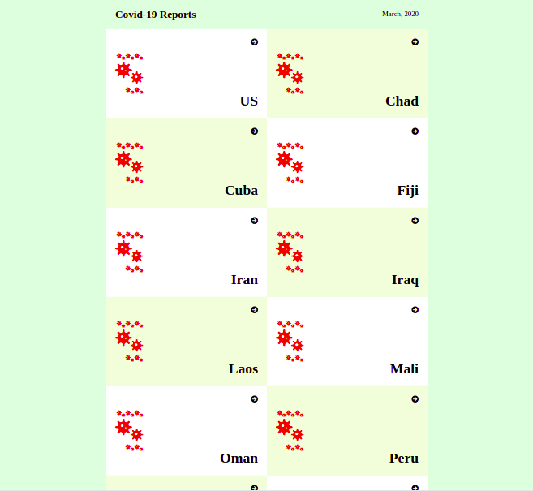

# Space Travelers' Hub
This web application is built to display covid-19 data of countries affected by pandemic. The application allows users to view list of countries and regions/cities affected.

## Built With
- JavaScript/React
- Redux
- CSS

## Live Demo

[View Life](https://duls-covid-reporter.herokuapp.com/)
  
## Setup
- Get the link of the repository: [https://github.com/wuyepabdul/react-capstone](https://github.com/wuyepabdul/react-capstone)
- Clone it as [git@github.com:wuyepabdul/react-capstone.git](git@github.com:wuyepabdul/react-capstone.git) on a Terminal
- Usage
- Run npm install on a Terminal to install the modules
- Run npm start on a Terminal to start the server
- Open http://localhost:3000 to view it in the browser.
  
## Authors

👤 **Abdul Wuyep**

- GitHub: [@wuyepabdul](https://github.com/wuyepabdul)
- Twitter: [@AbdulWuyep](https://twitter.com/AbdulWuyep)
- LinkedIn: [Abdul Wuyep](https://www.linkedin.com/in/abdul-wuyep/)

## 🤝 Contributing

Contributions, issues, and feature requests are welcome!

Feel free to check the [issues page](https://github.com/wuyepabdul/react-capstone).

## Show your support

Give a ⭐️ if you like this project!

## Acknowledgments
- Microverse
- Original design idea by - Nelson Sakwa on Behance
- React and React Router documentation
- Stack Overflow
